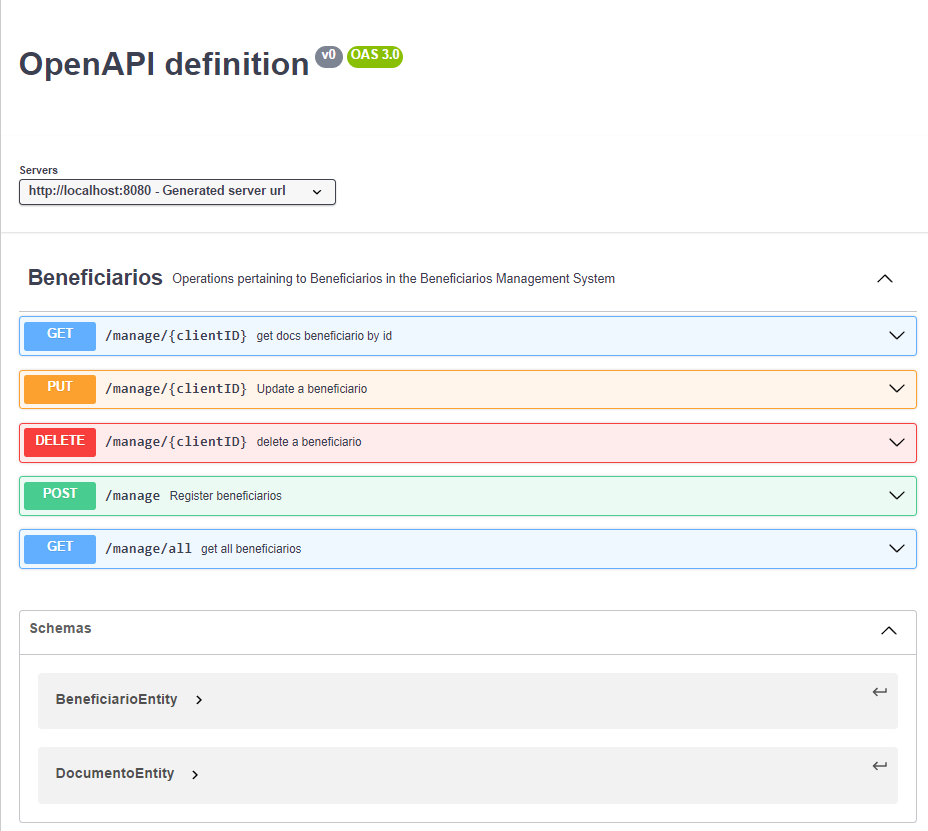

# Registro de beneficiários
Este é um backend CRUD para registro de beneficiários.


## 🛠 Tecnologias
- Java 17
- SpringBoot 3.3.0
- SpringData JPA
- H2 database 2.2.220
- Lombook
- Arquitetura Hexagonal


## Instalação

Faça o clone do repositório e dentro da pasta PlanoSaudeRegister execute o comando:

```bash
  mvn install
```

Após terminado a execução do install execute:

```bash
  mvn spring-boot:run
```

- Após executando acesse a documentação: http://localhost:8080/swagger-ui/index.html


[](https://www.linkedin.com/in/vicent-ramos-33954ab5/)


## Screenshots

